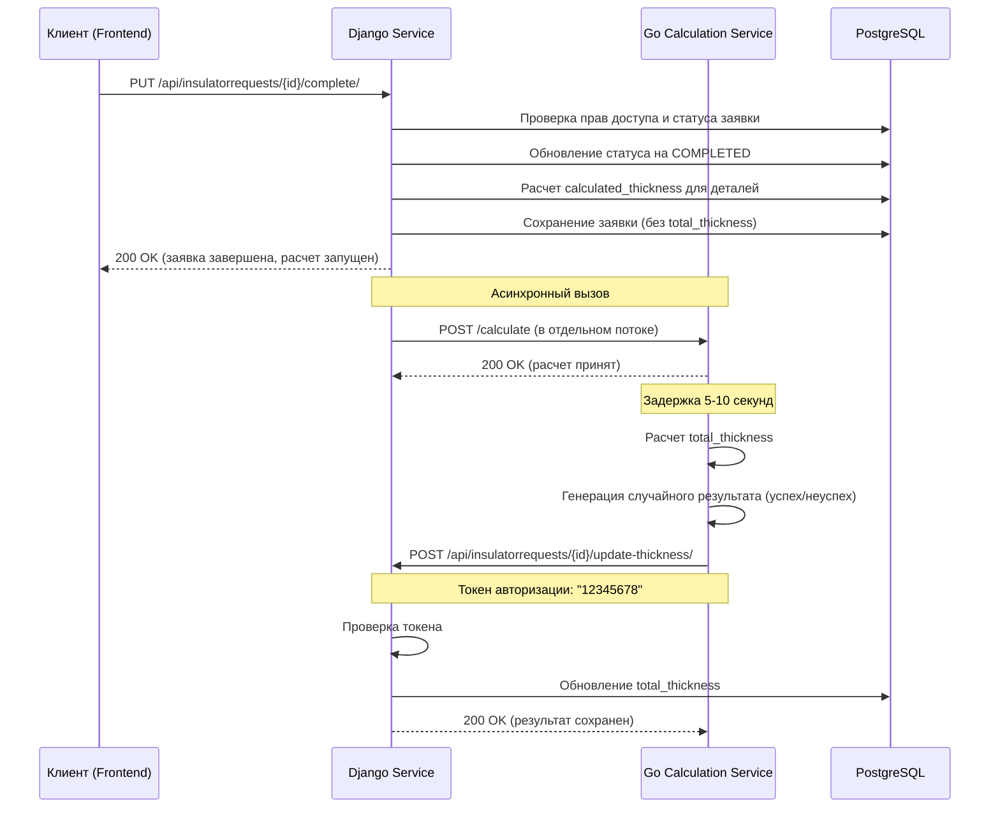
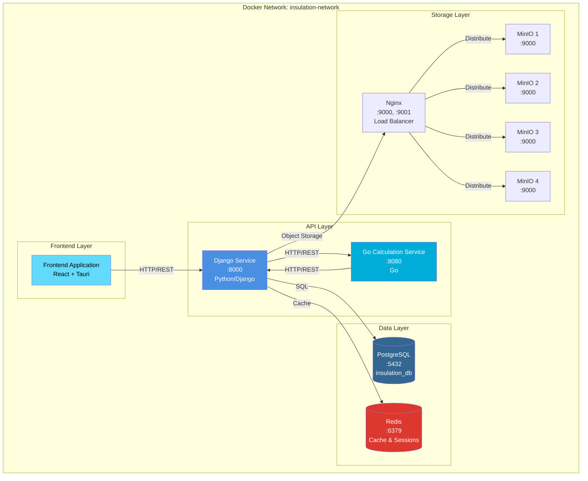

# Диаграммы системы

## Диаграмма последовательности: Завершение заявки с асинхронным расчетом total_thickness

## Диаграмма развертывания

## Описание компонентов

### Django Service
- **Порт**: 8000
- **Технологии**: Python, Django, Django REST Framework
- **Функции**:
  - Основной веб-сервис для управления заявками
  - Аутентификация и авторизация пользователей
  - Управление изоляторами и заявками
  - Прием результатов расчета от Go-сервиса

### Go Calculation Service
- **Порт**: 8080
- **Технологии**: Go
- **Функции**:
  - Асинхронный расчет total_thickness
  - Задержка выполнения 5-10 секунд
  - Генерация случайного результата (успех/неуспех)
  - Отправка результатов в Django через HTTP

### PostgreSQL
- **Порт**: 5432
- **База данных**: insulation_db
- **Хранение**: Заявки, изоляторы, детали заявок, пользователи

### Redis
- **Порт**: 6379
- **Использование**: Кэширование и хранение сессий

### MinIO Cluster
- **Порты**: 9000, 9001
- **Количество узлов**: 4
- **Использование**: Хранение изображений изоляторов
- **Балансировщик**: Nginx

## Взаимодействие сервисов

1. **Завершение заявки**:
   - Клиент отправляет запрос на завершение заявки в Django
   - Django обновляет статус заявки и рассчитывает calculated_thickness для деталей
   - Django асинхронно вызывает Go-сервис для расчета total_thickness
   - Go-сервис выполняет расчет с задержкой 5-10 секунд
   - Go-сервис отправляет результат обратно в Django с токеном авторизации
   - Django обновляет total_thickness в базе данных

2. **Псевдо-авторизация**:
   - Go-сервис использует токен "12345678" (8 байт) для авторизации
   - Django проверяет токен в методе update_thickness
   - Метод update_thickness доступен без стандартной аутентификации Django

3. **Асинхронность**:
   - Вызов Go-сервиса происходит в отдельном потоке Python
   - Клиент получает ответ сразу после обновления статуса заявки
   - Расчет total_thickness выполняется асинхронно

